# PF2e Exploration Automation

A set of macros that improve how exploration activities are handled in Foundry's Pathfinder 2e system.

## Contents

- [PF2e Exploration Automation](#pf2e-exploration-automation)
  - [Contents](#contents)
  - [Installation](#installation)
    - [Install](#install)
    - [Uninstall](#uninstall)
  - [The Macros](#the-macros)
  - [How To](#how-to)
    - [Terminology](#terminology)
    - [First Steps](#first-steps)
    - [Investigate](#investigate)
      - [When triggered](#when-triggered)
    - [Search](#search)
      - [When triggered](#when-triggered-1)
    - [Detect Magic](#detect-magic)
      - [When triggered](#when-triggered-2)
    - [Saving Throw](#saving-throw)
      - [When triggered](#when-triggered-3)

## Installation

### Install

1. Clone the repository into your `modules` folder. The module is not yet listed in the Foundry package registry.
2. Enable the module in your world.
3. A new folder named **PF2e Exploration Automation** will appear in your Macros directory.

That's it.

### Uninstall

1. Disable the module in your world.
2. Delete the **PF2e Exploration Automation** folder from your macros.

Just as simple.

## The Macros

| | Macro | What it does |
|---|---|---|
| 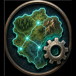 | `RegionAutomationMainMacros` | Opens the main dialog for editing the selected region. |
| 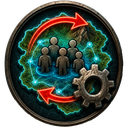 | `TriggerRegionForPartyMacros` | Manually triggers every check assigned to the selected region. |
| 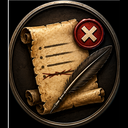 | `UnregisterRegionMacros` | Clears the region so that all tokens can trigger its hooks again. |

## How To

### Terminology

- **Region** — a Foundry entity the GM creates through the *Region Controls* menu.
- **Region Behavior** — a trigger added to the *Behaviors* tab of a region. It has a name and a type. For this module the type is always *Execute Script*; the module subscribes it to the appropriate events and inserts the script logic automatically.

### First Steps

1. **Create a region.** It can cover an entire room, so that every token entering it triggers the region's behavior. Alternatively, place it in a corner of the map where no token will ever walk, and trigger all of its checks against your players manually whenever you choose.

2. **Give the region a name.** The name is recorded in the **Log: Important Events** journal whenever one of the region's behaviors fires, so you can always trace which behavior was triggered by which player.

3. **Select the region and run**  (`RegionAutomationMainMacros`).

You will see this menu:

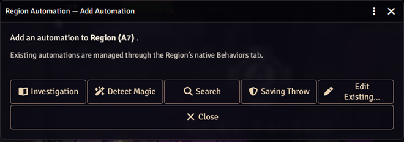

### Investigate

Click **Investigation** on the main menu:

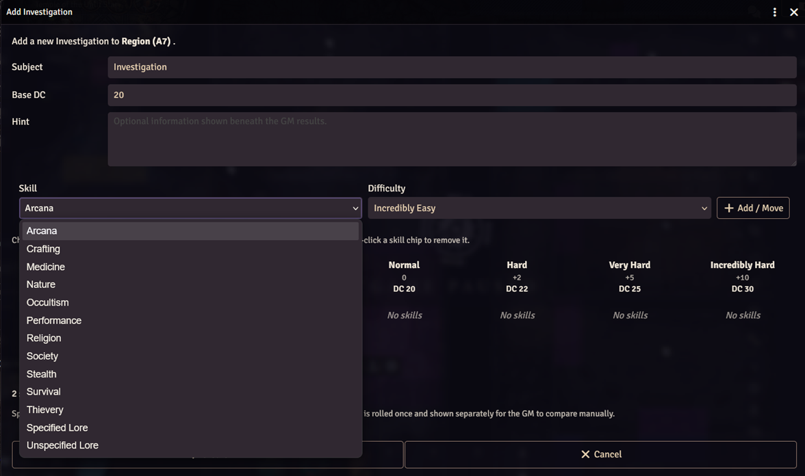

Set a default DC for the check, choose the skills that apply, and decide how difficult the discovery should be with each one.

You may end up with something like this:

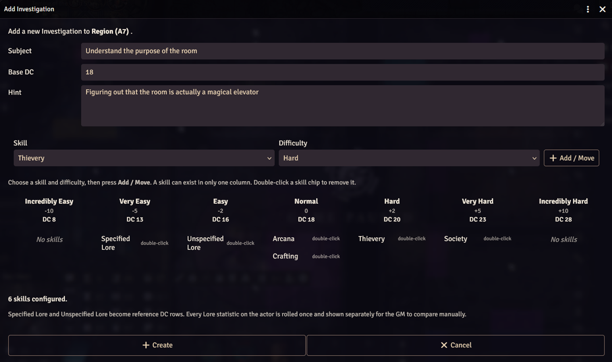

Here, Arcana and Crafting are of normal difficulty; Thievery works because the character can reason about the mechanism itself; and Society might reveal that such elevators were once fashionable in high society — but that connection is a long shot, so the check is Very Hard.

The Hint field accepts `@UUID[...]`, `@Check[...]`, `@Damage[...]` and similar inline syntax.

Click **Create**.

#### When triggered

When an investigating character's token enters the region, the GM sees a message like this:

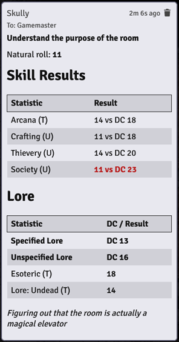

The roll was fairly average here, but not good enough to work out the purpose of the room — and Esoteric Lore and Undead Lore are unlikely to help this character much anyway. The GM may simply skip this part.

### Search

Click **Search** on the main menu:

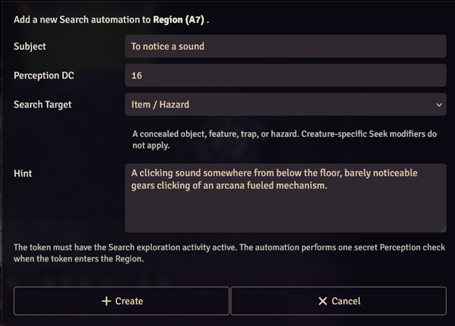

This is simpler. The only choice is whether the target of the search is an NPC or an item/hazard, because some feats specifically help with finding living creatures — such as Sensate Gnome — while others, such as Trap Finder, apply to traps.

The Hint field accepts `@UUID[...]`, `@Check[...]`, `@Damage[...]` and similar inline syntax.

Click **Create**.

#### When triggered

When a searching character's token enters the region, the GM sees a message like this:

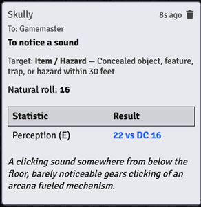

In this case the hero noticed a sound, and the GM can bring that to their attention.

The GM may then choose to lower the DC of the investigation check, which can change its outcome. The result of the investigation check is recorded in the **Log: Important Events** journal.

### Detect Magic

Click **Detect Magic** on the main menu:

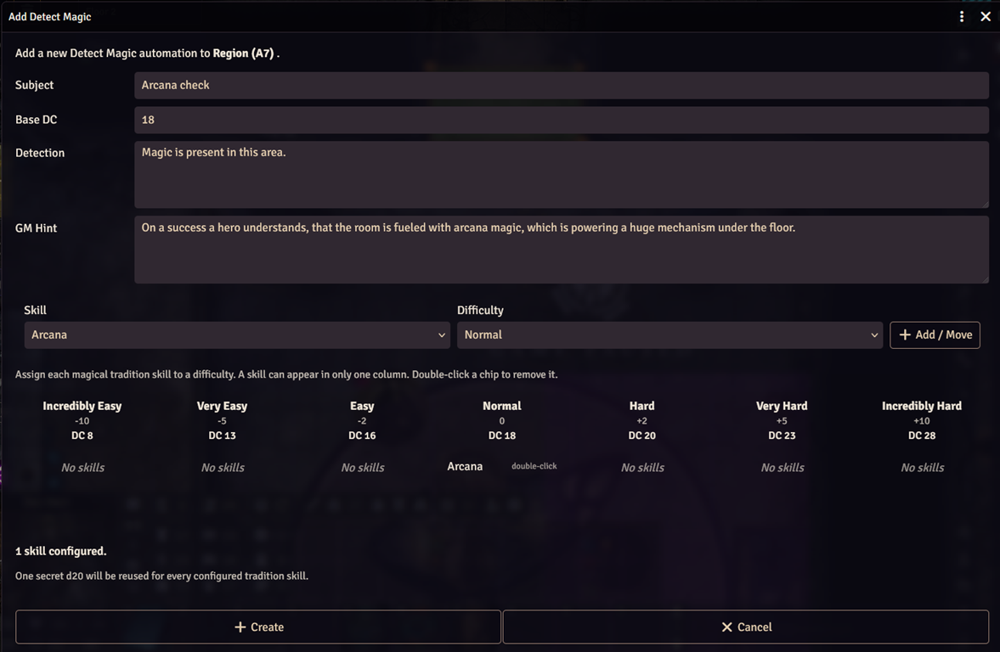

Detect Magic works automatically but reveals nothing specific on its own. It is easy for a GM to forget that a room contains something magical — a runic weapon inside a locked chest, for instance — so beyond acting as a reminder, this check can also yield more specific clues when the DC set by the GM is met.

How much to reveal is up to the GM, but players are usually glad to get something out of a magical search.

The GM can assign any magical traditions to any difficulty tier, either separately or in combination.

The Hint field accepts `@UUID[...]`, `@Check[...]`, `@Damage[...]` and similar inline syntax.

#### When triggered

When the token of a character using the Detect Magic exploration activity enters the region, the GM sees a message like this:

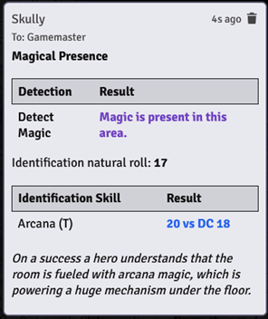

The GM should certainly tell the player that magic is present in the area, and may even mention the rank of the strongest magical effect if the cantrip's level is high enough — along with any hint the detection reveals.

### Saving Throw

Click **Saving Throw** on the main menu:

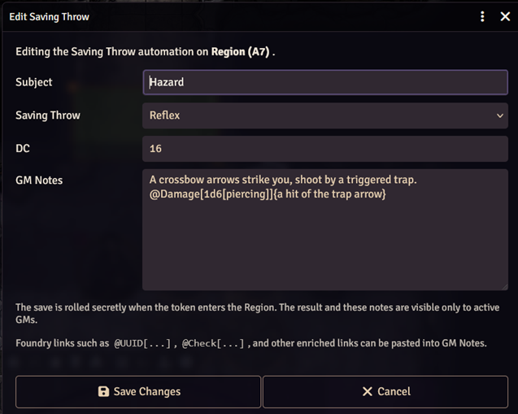

Reflex, Fortitude and Will are all supported.

The GM Notes field accepts `@UUID[...]`, `@Check[...]`, `@Damage[...]` and similar inline syntax.

This check fires for every character token that enters the region.

#### When triggered

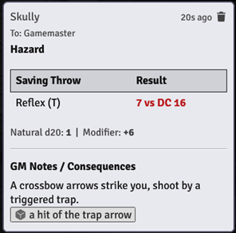

The GM receives a message like this and can, in this example, apply the damage by clicking the **a hit of the trap's arrow** button — or trigger whatever other effect has been stored in the GM Notes field.

---

> [!IMPORTANT]
> This tool was created with heavy use of AI.